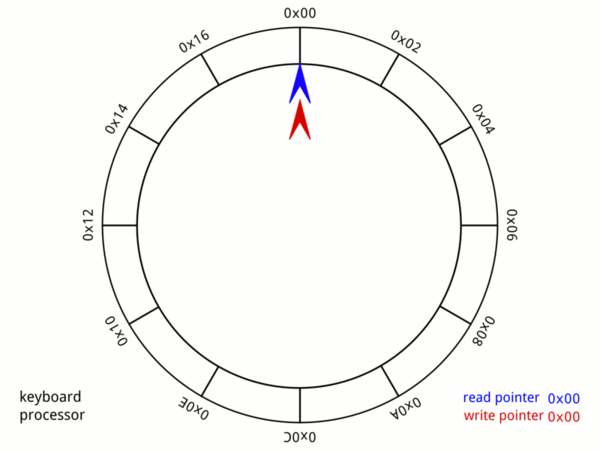

# ringbuffer

[](https://opensource.org/licenses/MIT) [](http://godoc.org/github.com/smallnest/ringbuffer)  [](https://goreportcard.com/report/github.com/smallnest/ringbuffer) [](https://coveralls.io/github/smallnest/ringbuffer?branch=master) 

A circular buffer (ring buffer) in Go, implemented io.ReaderWriter interface

[](https://github.com/smallnest/ringbuffer)

# Usage

```go
package main

import (
	"fmt"

	"github.com/smallnest/ringbuffer"
)

func main() {
	rb := ringbuffer.New(1024)

	// write
	rb.Write([]byte("abcd"))
	fmt.Println(rb.Length())
	fmt.Println(rb.Free())

	// read
	buf := make([]byte, 4)
	rb.Read(buf)
	fmt.Println(string(buf))
}
```

It is possible to use an existing buffer with by replacing `New` with `NewBuffer`.


# Blocking vs Non-blocking

The default behavior of the ring buffer is non-blocking, 
meaning that reads and writes will return immediately with an error if the operation cannot be completed.
If you want to block when reading or writing, you must enable it:

```go
	rb := ringbuffer.New(1024).SetBlocking(true)
```

Enabling blocking will cause the ring buffer to behave like a buffered [io.Pipe](https://pkg.go.dev/io#Pipe).

Regular Reads will block until data is available, but not wait for a full buffer. 
Writes will block until there is space available and writes bigger than the buffer will wait for reads to make space.

`TryRead` and `TryWrite` are still available for non-blocking reads and writes.

To signify the end of the stream, close the ring buffer from the writer side with `rb.CloseWriter()`

Either side can use `rb.CloseWithError(err error)` to signal an error and close the ring buffer. 
Any reads or writes will return the error on next call.

In blocking mode errors are stateful and the same error will be returned until `rb.Reset()` is called.

# io.Copy replacement

The ring buffer can replace `io.Copy` and `io.CopyBuffer` to do async copying through the ring buffer.

The copy operation will happen directly on the buffer, so between reads and writes there is no memory copy.

Here is a simple example where the copy operation is replaced by a ring buffer:

```go
func saveWebsite(url, file string) {
    in, _ := http.Get(url)
    out, _ := os.Create(file)

    // Copy with regular buffered copy
    // n, err := io.Copy(out, in.Body)

    // Copy with ring buffer
    n, err := ringbuffer.New(1024).Copy(out, in.Body)
    fmt.Println(n, err)
}
```

The ring buffer implements `io.ReaderFrom` and `io.WriterTo` interfaces, which allows to fill either or both
the write and read side respectively.

This will provide an async method for writing or reading directly into the ring buffer.
These functions require that "blocking" is set on the pipe.

Example:

```go
func readWebsite(url string) io.ReadCloser {
	in, _ := http.Get(url)

	// Create blocking ring buffer
	ring := ringbuffer.New(1024).SetBlocking(true)

	// Read from the input in a goroutine into the ring buffer
	go func() {
		ring.ReadFrom(in.Body)
		ring.CloseWriter()
	}()
	return ring.ReadCloser()
}
```

# io.Pipe replacement

The ring buffer can be used as a compatible, but *asynchronous* replacement of `io.Pipe`.

That means that Reads and Writes will go to the ring buffer.
Writes will complete as long as the data fits within the ring buffer.

Reads will attempt to satisfy reads with data from the ring buffer.
The read will only block if the ring buffer is empty.

In the common case, where the Read and Write side can run concurrently, 
it is safe to replace `io.Pipe()` with `(*Ringbuffer).Pipe()`.

Compare the following to the [io.Pipe example](https://pkg.go.dev/io#example-Pipe):  

```go
func main() {
	// Create pipe from a 4KB ring buffer.
	r, w := ringbuffer.New(4 << 10).Pipe()

	go func() {
		fmt.Fprint(w, "some io.Reader stream to be read\n")
		w.Close()
	}()

	if _, err := io.Copy(os.Stdout, r); err != nil {
		log.Fatal(err)
	}
}
```

When creating the pipe, the ring buffer is internally switched to blocking mode.

Error reporting on Close and CloseWithError functions is similar to `io.Pipe`.

It is possible to use the original ring buffer alongside the pipe functions. 
So for example it is possible to "seed" the ring buffer with data, 
so reads can complete at once.