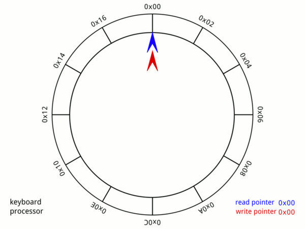

# ringbuffer

[](https://opensource.org/licenses/MIT) [](http://godoc.org/github.com/argcv/ringbuffer) [](https://goreportcard.com/report/github.com/argcv/ringbuffer)

A circular buffer (ring buffer) in Go, now with **generics** support and modernized for Go 1.23+.

This is a hard fork of [smallnest/ringbuffer](https://github.com/smallnest/ringbuffer) with breaking changes to adopt generics and modern Go features.

[](https://github.com/argcv/ringbuffer)

## Requirements

- Go 1.23+

## Features

- **Generic API**: `RingBuffer[T any]` supports arbitrary types, not just bytes.
- **Standard library compatibility**: `*RingBuffer[byte]` implements `io.Reader`, `io.Writer`, `io.Closer`, `io.ByteReader`, `io.ByteWriter`.
- **Blocking and non-blocking modes**: Configurable via `SetBlocking(true)`.
- **Overwrite mode**: `SetOverwrite(true)` allows overwriting oldest data when full.
- **Iterator support** (Go 1.23+): `All()` returns `iter.Seq[T]` for zero-allocation traversal.
- **Zero-copy string writing**: Modern `unsafe` usage for `WriteString`.
- **Goroutine-safe**: All operations are protected by `sync.Mutex`.
- **No external dependencies**.

## Installation

```bash
go get github.com/argcv/ringbuffer
```

## Usage

### Byte buffer (backward compatible)

```go
package main

import (
	"fmt"

	"github.com/argcv/ringbuffer"
)

func main() {
	rb := ringbuffer.New(1024)

	// write
	rb.Write([]byte("abcd"))
	fmt.Println(rb.Length())
	fmt.Println(rb.Free())

	// read
	buf := make([]byte, 4)
	rb.Read(buf)
	fmt.Println(string(buf))
}
```

### Generic ring buffer

```go
package main

import (
	"fmt"

	"github.com/argcv/ringbuffer"
)

func main() {
	rb := ringbuffer.NewGeneric[int](1024)

	// write
	rb.Write([]int{1, 2, 3, 4})
	fmt.Println(rb.Length())

	// read
	buf := make([]int, 4)
	rb.Read(buf)
	fmt.Println(buf)

	// iterate without consuming
	for v := range rb.All() {
		fmt.Println(v)
	}
}
```

### Blocking vs Non-blocking

The default behavior is non-blocking. Enable blocking to make it behave like a buffered `io.Pipe`:

```go
rb := ringbuffer.New(1024).SetBlocking(true)
```

### Overwrite mode

```go
rb := ringbuffer.New(64).SetOverwrite(true)
rb.Write([]byte("fill the buffer"))
rb.Write([]byte("new data")) // oldest data is discarded
```

### io.Copy replacement

`Copy` is now a package-level function that takes a `*RingBuffer[byte]`:

```go
func saveWebsite(url, file string) {
	in, _ := http.Get(url)
	out, _ := os.Create(file)

	// Copy with ring buffer
	rb := ringbuffer.New(1024)
	n, err := ringbuffer.Copy(rb, out, in.Body)
	fmt.Println(n, err)
}
```

### io.Pipe replacement

`Pipe` is now a package-level function:

```go
func main() {
	// Create pipe from a 4KB ring buffer.
	r, w := ringbuffer.Pipe(4 << 10)

	go func() {
		fmt.Fprint(w, "some io.Reader stream to be read\n")
		w.Close()
	}()

	if _, err := io.Copy(os.Stdout, r); err != nil {
		log.Fatal(err)
	}
}
```

### Iterator (Go 1.23+)

```go
rb := ringbuffer.NewGeneric[string](10)
rb.Write([]string{"a", "b", "c"})

for s := range rb.All() {
	fmt.Println(s)
}
```

## API Changes from upstream

This fork contains **breaking changes**:

| Before (upstream) | After (this fork) |
|---|---|
| `RingBuffer` (byte only) | `RingBuffer[T any]` (generic) |
| `New(size int) *RingBuffer` | `New(size int) *RingBuffer[byte]` |
| `NewBuffer(b []byte) *RingBuffer` | `NewBuffer(b []byte) *RingBuffer[byte]` |
| `NewGeneric[T](size int) *RingBuffer[T]` | **New** |
| `NewFromSlice[T](b []T) *RingBuffer[T]` | **New** |
| `rb.WriteString(s)` | `WriteString(rb, s)` (function) |
| `rb.ReadFrom(rd)` | `ReadFrom(rb, rd)` (function) |
| `rb.WriteTo(w)` | `WriteTo(rb, w)` (function) |
| `rb.Copy(dst, src)` | `Copy(rb, dst, src)` (function) |
| `rb.Pipe()` | `Pipe(size int)` or `PipeFrom(rb)` (functions) |
| `rb.All()` | **New** `iter.Seq[T]` iterator |
| `rb.Reset()` | Now clears underlying buffer with `clear()` |
| `rb.WithCancel(ctx)` | Goroutine leak fixed; exits cleanly on `Close`/`Reset` |

## Performance

Run benchmarks with:

```bash
make benchmark
```

## License

MIT
